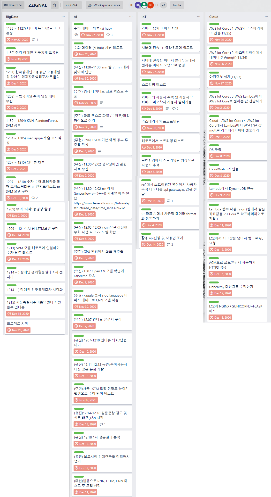

# ZZIGNAL (찌그널)
> 수어와 제스쳐 기반의 AI 비서
> - 프로젝트 기간 : 2020.11 ~ 2020.12
> - 멀티캠퍼스 융복합 프로젝트 경진대회 대상

## 기획
- Trello

## 개발
### DeepLearning
- Mediapipe, TensorFlow 2.0, Jupyter Nodebook
### Web Service
- Flask, VSCode

## [산출물](./documents/ZZIGNAL_포트폴리오.pdf)
